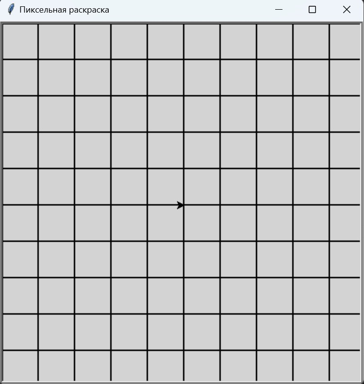
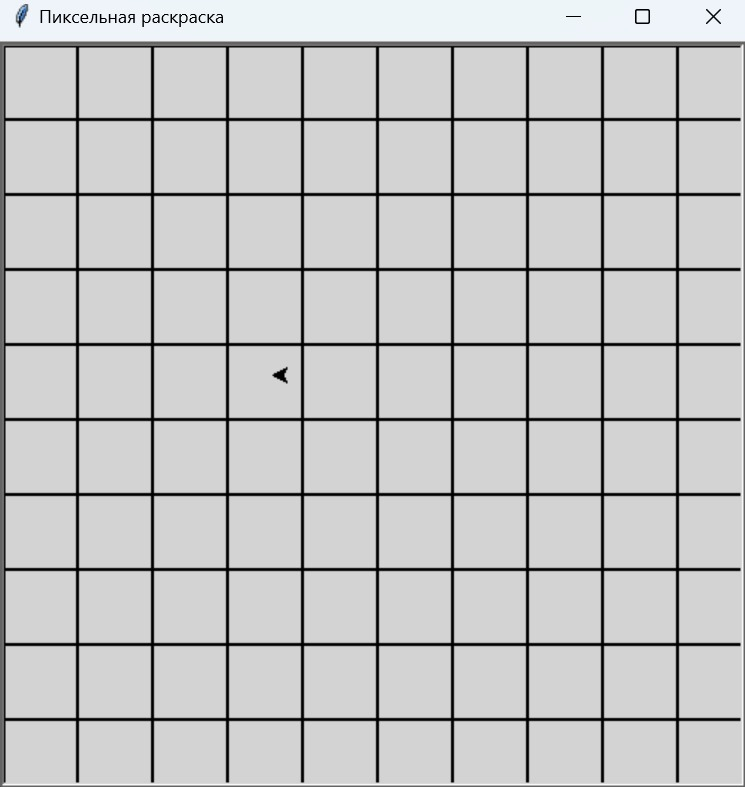
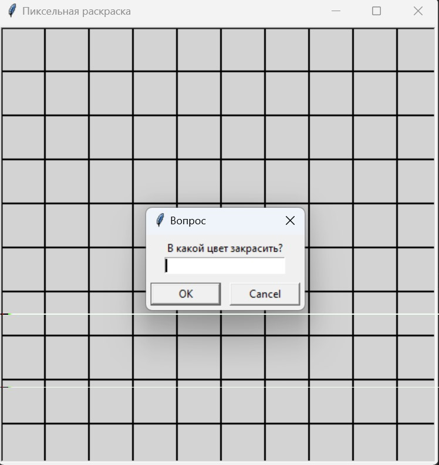
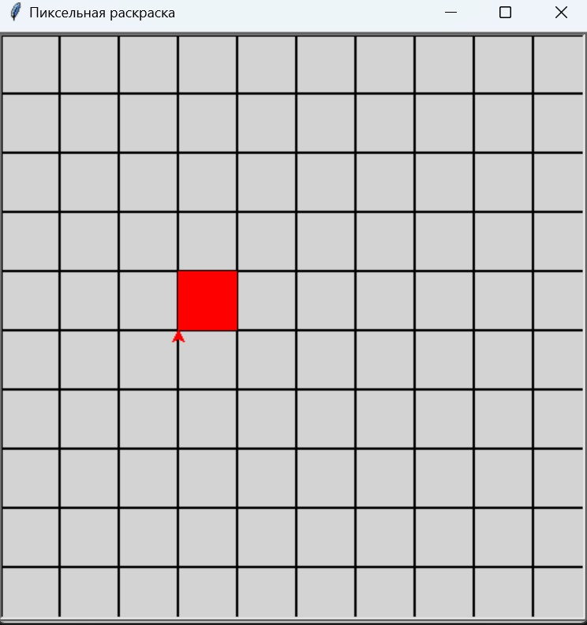
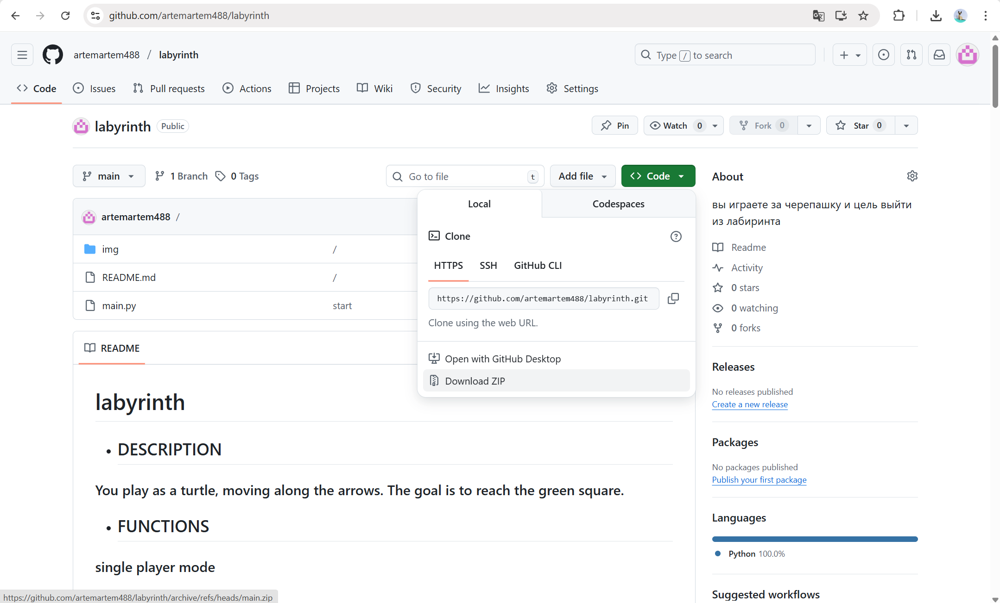

# PIXEL COLORING

* ## DESCRIPTION

You play as an arrow, moving it across a grid field and painting over squares.

* ## FUNCTIONS

single player mode

control:

-  up(`⭡`)
-  down(`⭣`)
-  right(`⭢`)
-  left(`⭠`)

- paint over(`enter`)
- close programm(`space`)

* ## SCREENSHOTS

### start:

### walk:

### fill color request:

### paints the square:

* ## START
To play the maze, you need:

1. Install Python https://www.python.org/downloads/release/python-3126/ from this link for your operating system (the game was written on this version)

Be sure to check the box next to "add python.exe to path"

2. Next, download the repository

Click CODE, then "Download zip"

Go to File Explorer -> Right-click on the folder, extract all -> Open the unzipped folder -> Right-click an empty space and open in Terminal

3. Type pip install shapely and wait for the download to complete

4. Type in the terminal python main.py
